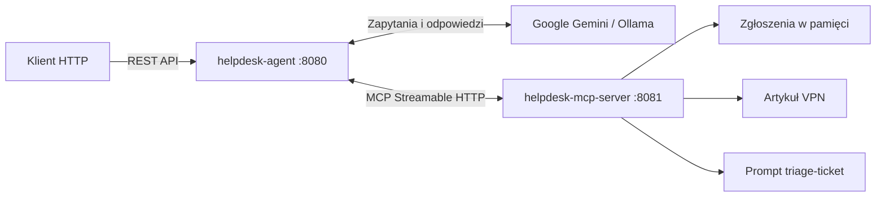

# HelpDesk AI Agent

Demonstracyjny asystent helpdesku IT zbudowany w **Java**, **Spring Boot** i **Spring AI**. Łączy model językowy z serwerem **Model Context Protocol (MCP)**, który udostępnia operacje na zgłoszeniach, zasoby bazy wiedzy i prompt do klasyfikacji problemów.

Projekt pokazuje obsługę rozmowy z pamięcią, odpowiedzi strumieniowe, wyniki w formacie JSON oraz mechanizmy MCP: **tools**, **resources**, **prompts**, **elicitation** i **progress notifications**.

## Spis treści

- [Architektura](#architektura)
- [Technologie i wymagania](#technologie-i-wymagania)
- [Uruchomienie](#uruchomienie)
- [API agenta](#api-agenta)
- [Możliwości serwera MCP](#możliwości-serwera-mcp)
- [Konfiguracja](#konfiguracja)
- [Testy](#testy)
- [Struktura projektu](#struktura-projektu)
- [Charakter demonstracyjny](#charakter-demonstracyjny)

## Architektura

Projekt składa się z dwóch niezależnie uruchamianych aplikacji:

| Moduł | Port | Odpowiedzialność |
| --- | --- | --- |
| `helpdesk-agent` | `8080` | REST API, rozmowa z modelem, pamięć konwersacji, klient MCP i klasyfikacja zgłoszeń |
| `helpdesk-mcp-server` | `8081` | Narzędzia MCP, repozytorium zgłoszeń, zasoby i prompt `triage-ticket` |



**Rozmowa:** agent przekazuje wiadomość do modelu wraz z historią wskazaną przez `conversationId`. Model może korzystać z narzędzi serwera MCP, np. wyszukać lub utworzyć zgłoszenie.

**Klasyfikacja:** `TicketTriageService` pobiera z MCP prompt `triage-ticket`, przekazując opis jako argument `description`. Następnie wykonuje analizę osobnym klientem modelu, bez pamięci rozmowy i narzędzi, i mapuje odpowiedź na `TicketClassification`.

## Technologie i wymagania

| Technologia | Wersja / zastosowanie |
| --- | --- |
| Java | **25** |
| Spring Boot | **4.1.1** |
| Spring AI | **2.0.1** |
| Maven | Projekt wielomodułowy |
| Spring Web MVC | REST API i serwer MCP |
| Project Reactor | Odpowiedzi strumieniowe i kanał powiadomień |
| Google GenAI / Ollama | Dostawcy modelu językowego |
| JUnit / Mockito | Testy |

Do uruchomienia potrzebujesz JDK 25, Mavena oraz jednego z dostawców modelu:

- **Google Gemini** — klucz API i dostęp do wybranego modelu;
- **Ollama** — działająca instancja z pobranym modelem obsługującym wywołania narzędzi.

## Uruchomienie

Wszystkie poniższe polecenia budowania i uruchamiania wykonuj z katalogu projektu — tego, który zawiera główny `pom.xml` i oba moduły. Dzięki temu import pliku `secrets.env` wskazuje właściwą lokalizację.

### 1. Zbuduj aplikacje

```bash
mvn clean package -DskipTests
```

Powstaną dwa pliki wykonywalne:

```text
helpdesk-agent/target/helpdesk-agent-0.0.1-SNAPSHOT.jar
helpdesk-mcp-server/target/helpdesk-mcp-server-0.0.1-SNAPSHOT.jar
```

### 2. Uruchom serwer MCP

W pierwszym terminalu:

```bash
java -jar helpdesk-mcp-server/target/helpdesk-mcp-server-0.0.1-SNAPSHOT.jar
```

Serwer nasłuchuje na porcie `8081`. Uruchom go przed agentem, który podczas startu inicjalizuje połączenie MCP.

### 3. Uruchom agenta z wybranym modelem

#### Google Gemini — profil domyślny

Utwórz plik `secrets.env` w katalogu projektu:

```properties
GEMINI_API_KEY=twoj_klucz_api
```

Plik jest wykluczony z Gita przez `.gitignore`. Klucz można też przekazać jako zmienną środowiskową `GEMINI_API_KEY`.

Uruchom agenta w drugim terminalu:

```bash
java -jar helpdesk-agent/target/helpdesk-agent-0.0.1-SNAPSHOT.jar --spring.profiles.active=google
```

Profil konfiguruje model `gemini-3.5-flash-lite`. Nazwę modelu można zmienić w `application-google.properties` lub argumentem `--spring.ai.google.genai.chat.options.model=NAZWA_MODELU`.

#### Ollama

Uruchom Ollamę pod adresem `http://localhost:11434` i pobierz wybrany model, np.:

```bash
ollama pull qwen3:8b
```

Uruchom agenta, wskazując pobrany model:

```bash
java -jar helpdesk-agent/target/helpdesk-agent-0.0.1-SNAPSHOT.jar --spring.profiles.active=ollama --spring.ai.ollama.chat.options.model=qwen3:8b
```

Bez nadpisania nazwy modelu profil `ollama` używa skonfigurowanego `qwen3.8:latest`. Adres instancji można zmienić argumentem `--spring.ai.ollama.base-url=http://HOST:11434`.

## API agenta

Adres bazowy: `http://localhost:8080`.

| Metoda | Endpoint | Wynik |
| --- | --- | --- |
| `POST` | `/api/mcp` | Tekstowa odpowiedź po zakończeniu wywołania modelu |
| `POST` | `/api/mcp/stream` | Strumień fragmentów odpowiedzi tekstowej |
| `POST` | `/api/mcp/triage` | Klasyfikacja zgłoszenia w formacie JSON |

Każdy endpoint przyjmuje obiekt `ChatRequest`:

```json
{
  "conversationId": "demo-001",
  "message": "Nie mogę połączyć się z firmową siecią VPN."
}
```

Dla rozmowy używaj tego samego `conversationId` w kolejnych wiadomościach, aby zachować kontekst. Endpoint `/triage` analizuje wyłącznie bieżący opis; nie korzysta z historii konwersacji.

Poniższe przykłady używają składni Bash, np. Linux, macOS lub Git Bash na Windows.

### Rozmowa

```bash
curl -X POST http://localhost:8080/api/mcp \
  -H 'Content-Type: application/json' \
  -d '{"conversationId":"demo-001","message":"Pokaż otwarte zgłoszenia z kategorii NETWORK."}'
```

Przykładowe kolejne wiadomości:

- „Pokaż szczegóły zgłoszenia TICKET-003.”
- „Utwórz zgłoszenie: mój laptop nie uruchamia się, problem blokuje mi pracę. Kategoria HARDWARE, priorytet HIGH.”
- „Zamknij zgłoszenie TICKET-001 z komentarzem: wymieniono zasilacz.”
- „Wygeneruj raport zgłoszeń.”

### Odpowiedź strumieniowa

```bash
curl -N -X POST http://localhost:8080/api/mcp/stream \
  -H 'Content-Type: application/json' \
  -d '{"conversationId":"demo-002","message":"Pomóż mi opisać problem z uruchomieniem laptopa."}'
```

Opcja `-N` wyłącza buforowanie wyjścia w `curl`.

### Klasyfikacja zgłoszenia

```bash
curl -X POST http://localhost:8080/api/mcp/triage \
  -H 'Content-Type: application/json' \
  -d '{"conversationId":"triage-001","message":"Nie mogę zalogować się do konta. Nie wiem, czy inni użytkownicy mają ten sam problem."}'
```

Przykładowa odpowiedź — treść zależy od modelu:

```json
{
  "category": "ACCESS",
  "priority": "MEDIUM",
  "summary": "Brak możliwości zalogowania się do konta",
  "reasoning": "Problem dotyczy dostępu do konta. Brakuje danych o wpływie na pracę i innych użytkowników.",
  "needsClarification": true,
  "questions": [
    "Jaki komunikat pojawia się przy logowaniu?",
    "Czy problem całkowicie blokuje pracę?"
  ]
}
```

Kategorie: `HARDWARE`, `SOFTWARE`, `NETWORK`, `ACCESS`, `OTHER`.

Priorytety: `LOW`, `MEDIUM`, `HIGH`, `CRITICAL`.

Zasady klasyfikacji i format wyniku znajdują się w [triage-ticket.txt](helpdesk-mcp-server/src/main/resources/prompt-messages/triage-ticket.txt). Klasyfikacja nie tworzy ani nie modyfikuje zgłoszenia.

## Możliwości serwera MCP

Serwer wykorzystuje transport **Streamable HTTP**. Domyślny endpoint protokołu to `http://localhost:8081/mcp`; agent ma skonfigurowany adres bazowy `http://localhost:8081` dla połączenia o nazwie `helpdesk`.

### Narzędzia

| Nazwa | Parametry | Działanie |
| --- | --- | --- |
| `create_ticket` | `title`, `description`, `priority`, `category` | Tworzy zgłoszenie ze statusem `OPEN` |
| `search_tickets` | Opcjonalne `status`, `category` | Wyszukuje zgłoszenia; bez filtrów zwraca wszystkie |
| `get_ticket` | `id` | Pobiera zgłoszenie po identyfikatorze |
| `close_ticket` | `id`, `comment` | Ustawia status `CLOSED` i dopisuje komentarz do opisu |
| `generateWeeklyReport` | Brak parametrów biznesowych | Zwraca liczbę wszystkich, otwartych i zamkniętych zgłoszeń oraz wysyła powiadomienia postępu |

Statusy: `OPEN`, `IN_PROGRESS`, `CLOSED`.

### Zasoby

| URI | Zawartość |
| --- | --- |
| `helpdesk://kb/vpn` | Artykuł z bazy wiedzy dotyczący VPN |
| `helpdesk://tickets/{id}` | Szczegóły wskazanego zgłoszenia |

Zasoby są dostępne dla klientów MCP. Samo zarejestrowanie narzędzi w `ChatClient` nie wczytuje automatycznie treści zasobów do rozmowy.

### Prompty i interakcje

- **`triage-ticket`** — prompt z wymaganym argumentem `description`; określa kategorię, priorytet i pytania uzupełniające.
- **Elicitation** — przy tworzeniu zgłoszenia `CRITICAL` serwer prosi klienta o `confirm` i `affectedUsers`. Brak poprawnego potwierdzenia obniża priorytet do `HIGH`.
- **Progress notifications** — generowanie raportu wysyła postęp od 20 do 100. Agent zapisuje otrzymane powiadomienia w logach.

## Konfiguracja

Pliki konfiguracyjne:

- [Konfiguracja agenta](helpdesk-agent/src/main/resources/application.properties)
- [Profil Google](helpdesk-agent/src/main/resources/application-google.properties)
- [Profil Ollama](helpdesk-agent/src/main/resources/application-ollama.properties)
- [Konfiguracja serwera MCP](helpdesk-mcp-server/src/main/resources/application.properties)

| Ustawienie | Wartość domyślna | Znaczenie |
| --- | --- | --- |
| `spring.profiles.active` | `google` | Profil dostawcy modelu w agencie |
| `spring.ai.mcp.client.streamable-http.connections.helpdesk.url` | `http://localhost:8081` | Adres serwera MCP |
| `spring.ai.mcp.client.type` | `SYNC` | Synchroniczny klient MCP |
| `spring.ai.mcp.client.request-timeout` | `120s` | Limit czasu wywołania MCP |
| `spring.threads.virtual.enabled` | `true` | Wątki wirtualne w agencie |
| `spring.ai.mcp.server.protocol` | `STREAMABLE` | Transport serwera MCP |
| `prompts-filepath` | `prompt-messages/` | Katalog promptów na classpath serwera |

Przykład zmiany portu serwera i adresu połączenia agenta:

```bash
java -jar helpdesk-mcp-server/target/helpdesk-mcp-server-0.0.1-SNAPSHOT.jar --server.port=9081
```

```bash
java -jar helpdesk-agent/target/helpdesk-agent-0.0.1-SNAPSHOT.jar --spring.ai.mcp.client.streamable-http.connections.helpdesk.url=http://localhost:9081
```

## Testy

Zestaw niewymagający uruchomionego zewnętrznego serwera MCP ani klucza modelu:

```bash
mvn -Dtest=TicketTriageServiceTests,TicketConfigurationTests,TicketToolsTests,HelpdeskMcpServerApplicationTests -Dsurefire.failIfNoSpecifiedTests=false test
```

Obejmuje pobieranie promptu i mapowanie klasyfikacji, odczyt zasobu bez ścieżki systemu plików, potwierdzanie priorytetu krytycznego oraz start kontekstu serwera MCP. Model i klient MCP w teście klasyfikacji są mockowane.

Pełny zestaw testów:

```bash
mvn test
```

Test kontekstu agenta korzysta z konfiguracji aplikacji: przed jego uruchomieniem uruchom serwer MCP i zapewnij konfigurację wybranego dostawcy modelu. Przy profilu Google można przekazać `GEMINI_API_KEY` jako zmienną środowiskową; import względnego pliku `secrets.env` zależy od katalogu roboczego procesu testowego.

## Struktura projektu

```text
HelpDeskAIAgent/
├── pom.xml                         # Wspólny POM i moduły
├── readme.md
├── helpdesk-agent/
│   ├── pom.xml
│   ├── mvnw / mvnw.cmd             # Maven Wrapper
│   └── src/
│       ├── main/
│       │   ├── java/pl/emkgeek/helpdeskagent/
│       │   │   ├── config/         # ChatClient i handlery MCP
│       │   │   ├── controller/     # REST API
│       │   │   ├── dto/            # Żądania, klasyfikacja, powiadomienia
│       │   │   └── service/        # Klasyfikacja z promptem MCP
│       │   └── resources/          # Konfiguracja i profile modeli
│       └── test/
└── helpdesk-mcp-server/
    ├── pom.xml
    ├── mvnw / mvnw.cmd             # Maven Wrapper
    └── src/
        ├── main/
        │   ├── java/pl/emkgeek/helpdeskmcpserver/
        │   │   ├── config/         # Ładowanie promptu
        │   │   ├── dto/            # Zgłoszenia i potwierdzenie CRITICAL
        │   │   ├── prompt/         # Prompty MCP
        │   │   ├── repository/     # Repozytorium w pamięci
        │   │   ├── resource/       # Zasoby MCP
        │   │   ├── service/        # Odczyt artykułu i szczegółów zgłoszeń
        │   │   └── tools/          # Narzędzia MCP
        │   └── resources/
        │       ├── application.properties
        │       ├── kb/vpn.md
        │       └── prompt-messages/triage-ticket.txt
        └── test/
```

## Charakter demonstracyjny

- Zgłoszenia są przechowywane w `ConcurrentHashMap`. Restart serwera usuwa zmiany i odtwarza pięć przykładowych zgłoszeń `TICKET-001`–`TICKET-005`.
- Handler elicitation w agencie automatycznie zwraca `confirm=true` i `affectedUsers=1`. Kanał powiadomień nie ma obecnie endpointu do prezentacji formularza i odbioru odpowiedzi użytkownika.
- `generateWeeklyReport` podsumowuje wszystkie zgłoszenia, bez filtrowania dat. Sztuczne opóźnienia prezentują mechanizm powiadomień postępu.
- Interfejsem użytkownika jest REST API; projekt nie zawiera aplikacji frontendowej.
